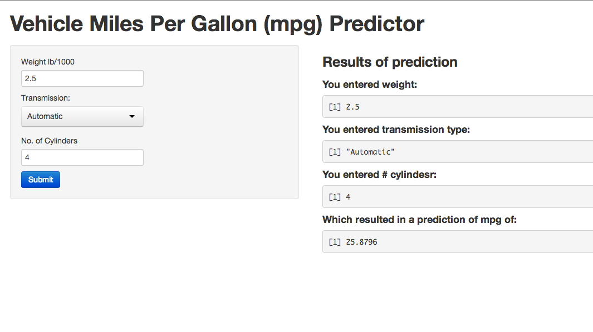

---
title       : Slidify Deck for mpgPredictor
subtitle    : Data Products
author      : Rajeev Vij
job         : IT Architect
framework   : io2012        # {io2012, html5slides, shower, dzslides, ...}
highlighter : highlight.js  # {highlight.js, prettify, highlight}
hitheme     : tomorrow      # 
widgets     : [quiz, bootstrap, interactive]            # {mathjax, quiz, bootstrap}
mode        : selfcontained # {standalone, draft}
knit        : slidify::knit2slides
--- .class #id0

## Agenda  

1. mpgPredictor Application What it does?
2. How it is built?
3. How it can be used?

--- .class #id1 

## mpgPRedictor Application
- Machine learning application to predict Miles per gallon of a vehicle given input parameters
- Input parameters include weight, # of cynlinders and Transmission type
- This is an interactive web app where user can provide inputs and get prediction values

--- .class #id2 

## How it is built
- mpgPredictor application is built using Shiny Apps Web framework
- UI is designed using Shiny templates
- Predictor is built using Regression model built around "mtcars" dataset

--- .class #id3

## How it be used
- mpgPredictor application is published on web server
- The application is very interactive form end users
- Prediction model is based on current available dataset
- Predicton model should be extended to include additional data

--- .class #id4 

## Sample Application Screen-shot
- Following screen-shot shows application web layout

